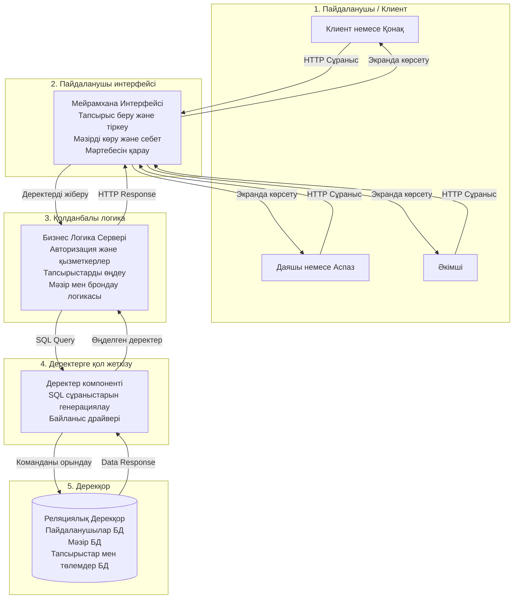

```mermaid
graph TD
    subgraph Client ["1. Пайдаланушы / Клиент"]
        A1[Клиент немесе Қонақ]
        A2[Даяшы немесе Аспаз]
        A3[Әкімші]
    end

    subgraph Presentation ["2. Пайдаланушы интерфейсі"]
        B["Мейрамхана Интерфейсі<br>Тапсырыс беру және тіркеу<br>Мәзірді көру және себет<br>Мәртебесін қарау"]
    end

    subgraph Business ["3. Қолданбалы логика"]
        C["Бизнес Логика Сервері<br>Авторизация және қызметкерлер<br>Тапсырыстарды өңдеу<br>Мәзір мен брондау логикасы"]
    end

    subgraph DataAccess ["4. Деректерге қол жеткізу"]
        D["Деректер компоненті<br>SQL сұраныстарын генерациялау<br>Байланыс драйвері"]
    end

    subgraph Database ["5. Дерекқор"]
        E[("Реляциялық Дерекқор<br>Пайдаланушылар БД<br>Мәзір БД<br>Тапсырыстар мен төлемдер БД")]
    end

    %% Байланыстар
    A1 & A2 & A3 -->|HTTP Сұраныс| B
    B -->|Деректерді жіберу| C
    C -->|SQL Query| D
    D -->|Команданы орындау| E
    
    E -->|Data Response| D
    D -->|Өңделген деректер| C
    C -->|HTTP Response| B
    B -->|Экранда көрсету| A1 & A2 & A3
```